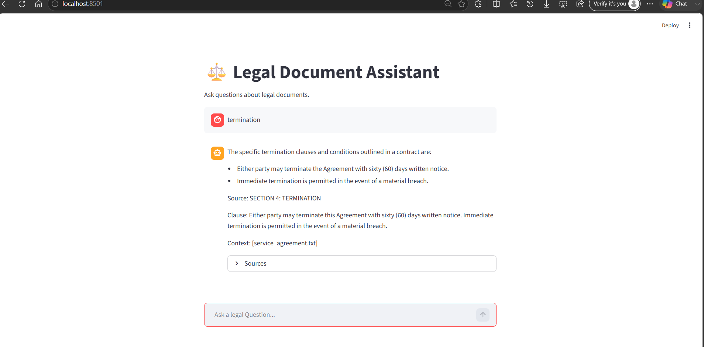

# ⚖️ Legal Document Assistant

A Retrieval-Augmented Generation (RAG) application for querying legal documents using natural language.

This project processes legal agreements, stores them in a vector database, retrieves relevant clauses using semantic search, and generates grounded answers with source attribution.

Built as the Saturday Project (Project 2 Foundation) of Week 14 – Hyderabad ML Mission 2026.

---

# Project Overview

Legal documents are often lengthy and difficult to navigate manually. Finding specific clauses such as notice periods, termination conditions, confidentiality obligations, or employee benefits can take significant time.

This project solves that problem by combining:

- Legal document processing
- Semantic search
- Query rewriting
- Vector databases
- Local LLM inference
- Source attribution

Users can ask questions in natural language and receive answers grounded in the retrieved legal documents.

---

# Features

✅ Legal document ingestion

✅ Section-aware chunking

✅ Metadata enrichment

✅ Semantic search with Chroma

✅ MMR retrieval

✅ Query rewriting

✅ Local LLM inference using Ollama

✅ Source attribution

✅ Anti-hallucination prompting

✅ Streamlit chat interface

---

# Architecture

```text
Legal Documents
        │
        ▼
Document Loader
        │
        ▼
Section-Aware Chunking
        │
        ▼
Metadata Enrichment
        │
        ▼
Embeddings (MiniLM)
        │
        ▼
Chroma Vector Store
        │
        ▼
─────────────────────────────
User Query
        │
        ▼
Query Rewriter
        │
        ▼
MMR Retriever
        │
        ▼
LCEL RAG Chain
        │
        ▼
Ollama (Llama 3.2)
        │
        ▼
Answer + Citations
        │
        ▼
Streamlit UI
```

Future version:

```markdown

```

---

# Project Structure

```text
legal_document_assistant/
│
├── app.py
├── main.py
├── setup.py
│
├── chains/
│   ├── legal_rag_chain.py
│   └── prompts.py
│
├── query_rewriting/
│   └── query_rewriter.py
│
├── loaders/
│   └── document_loader.py
│
├── splitters/
│   └── legal_splitter.py
│
├── metadata/
│   └── enrich_metadata.py
│
├── embeddings/
│   └── embedding_model.py
│
├── vectorstore/
│   └── chroma_store.py
│
├── retrieval/
│   └── retriever.py
│
├── data/
│   ├── employment_contract.txt
│   ├── nda.txt
│   └── service_agreement.txt
│
└── README.md
```

---

# Dataset

The project uses three legal-style documents:

### Employment Contract

Contains:

- Employment terms
- Probation period
- Notice period
- Leave policy
- Health benefits

### Non-Disclosure Agreement

Contains:

- Confidential information
- Obligations
- Agreement duration
- Exceptions

### Service Agreement

Contains:

- Services
- Payment terms
- Intellectual property
- Termination clauses
- Liability

---

# Legal Document Processing Pipeline

## 1. Document Loading

Documents are loaded from the data directory.

```python
documents = load_documents("data")
```

---

## 2. Section-Aware Chunking

Instead of arbitrary chunking, legal sections are preserved.

Example:

```text
SECTION 2: NOTICE PERIOD

Either party may terminate employment
by providing ninety (90) days written notice.
```

This improves retrieval quality.

---

## 3. Metadata Enrichment

Each chunk receives metadata:

```python
{
    "source": "employment_contract.txt",
    "clause": "SECTION 2: NOTICE PERIOD"
}
```

This enables source attribution.

---

## 4. Embeddings

Model:

```text
all-MiniLM-L6-v2
```

Used for semantic similarity search.

Example:

```text
notice period
```

and

```text
employment termination notice
```

produce similar embeddings.

---

## 5. Chroma Vector Database

Stores document embeddings.

Responsibilities:

- Vector storage
- Similarity search
- Retrieval

---

## 6. Query Rewriting

Short user queries are expanded into retrieval-friendly searches.

Example:

Input:

```text
leave
```

Rewritten:

```text
What are the specific terms and conditions
related to leave of absence in employment contracts?
```

This improves retrieval quality.

---

## 7. MMR Retrieval

Retriever configuration:

```python
search_type="mmr"
```

Benefits:

- Better diversity
- Reduced duplicate chunks
- Improved context quality

---

## 8. Legal RAG Chain

Built using LCEL.

Pipeline:

```text
Retriever
↓
Format Context
↓
Prompt
↓
Llama 3.2
↓
Answer
```

---

## 9. Anti-Hallucination Layer

Prompt rules:

- Use only provided context
- No outside knowledge
- No guessing
- Reject unsupported answers

Example:

Question:

```text
What is the CEO salary?
```

Output:

```text
I could not find that information in the documents.
```

---

# Streamlit Interface

The application provides a chat-based legal assistant.

### Example UI

```markdown

```

Place your screenshot in:

```text
images/streamlit_ui.png
```

---

# Example Questions

### Employment Contract

```text
What is the notice period?
```

```text
How many leave days are provided?
```

```text
Who receives health insurance?
```

---

### NDA

```text
How long does the NDA remain effective?
```

```text
What information is considered confidential?
```

---

### Service Agreement

```text
Under what conditions can the agreement be terminated?
```

---

# Sample Output

Question:

```text
notice period
```

Rewritten Query:

```text
What is the notice period for termination of employment?
```

Answer:

```text
The notice period for termination of employment
is ninety (90) days.
```

Source:

```text
employment_contract.txt
SECTION 2: NOTICE PERIOD
```

---

# Installation

Clone repository:

```bash
git clone <repository-url>
```

Move into project:

```bash
cd legal_document_assistant
```

Install dependencies:

```bash
pip install -r requirements.txt
```

---

# Ollama Setup

Install Ollama:

```bash
https://ollama.com
```

Pull model:

```bash
ollama pull llama3.2
```

Verify:

```bash
ollama list
```

---

# Run Streamlit Application

```bash
streamlit run app.py
```

Open:

```text
http://localhost:8501
```

---

# Technologies Used

### RAG

- LangChain
- LCEL

### Embeddings

- Sentence Transformers
- all-MiniLM-L6-v2

### Vector Database

- Chroma

### LLM

- Ollama
- Llama 3.2

### Frontend

- Streamlit

---

# Learning Outcomes

This project demonstrates:

- Legal document processing
- Metadata enrichment
- Section-aware chunking
- Embedding generation
- Vector databases
- Semantic retrieval
- MMR retrieval
- Query rewriting
- LCEL pipelines
- Local LLM deployment
- Source attribution
- Anti-hallucination techniques
- Streamlit application development

---

# Future Improvements

- PDF ingestion with PyMuPDF
- Clause-aware chunking
- BM25 retrieval
- Hybrid search
- Cross-Encoder reranking
- Faithfulness checking
- Conversational memory
- RAGAS evaluation
- Multi-document legal search
- FastAPI backend deployment

---

# Demo

Demo video coming soon.

Architecture diagram coming soon.

---

# Author

Mohammed Mateen
